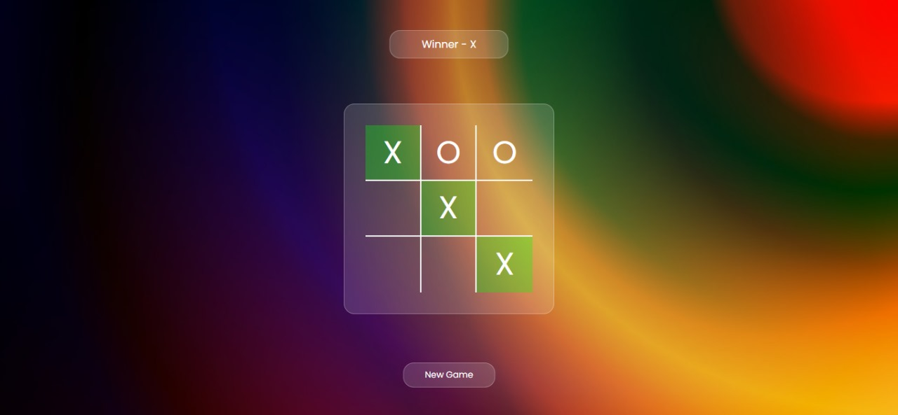

# Tic-Tac-Toe Game

This is a simple Tic-Tac-Toe game built with HTML, CSS, and JavaScript. The game allows two players to play Tic-Tac-Toe in the browser, with a clear indication of the current player, winner, and tied games.

## Features

- Two-player functionality
- Displays current player
- Highlights winning combination
- Indicates when the game is tied
- Option to start a new game

## Demo



## Technologies Used

- HTML
- CSS
- JavaScript

## Setup and Installation

1. Clone the repository:
    ```sh
    git clone https://github.com/yourusername/tic-tac-toe.git
    ```
2. Navigate to the project directory:
    ```sh
    cd tic-tac-toe
    ```
3. Open `index.html` in your browser to play the game.


